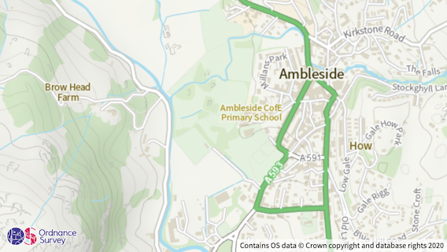

# OS API Branding

Branding for users developing solutions using OS data supplied via our APIs.



## Installation

Include the following tags in the header section of your HTML document to add the official OS logo and attribution to your map `<div>`:

```html
<link rel="stylesheet" href="os-api-branding.css" />
<script src="os-api-branding.js"></script>
```

The latest CDN versions can be accessed via:

```html
<link rel="stylesheet" href="https://cdn.jsdelivr.net/gh/OrdnanceSurvey/os-api-branding/os-api-branding.css" />
<script src="https://cdn.jsdelivr.net/gh/OrdnanceSurvey/os-api-branding/os-api-branding.js"></script>
```

Hosted versions can also be found at:

```html
<link rel="stylesheet" href="https://labs.os.uk/public/os-api-branding/v0.3.1/os-api-branding.css" />
<script src="https://labs.os.uk/public/os-api-branding/v0.3.1/os-api-branding.js"></script>
```

## Usage

In the majority of cases [assuming a map `<div>` element with `id="map"` is used] the branding can be shown using the basic installation as listed above.

For more advanced cases, the branding can be customised through the use of **data-*** attributes on the `<script>` import tag.

The table below lists the available options:

|Attribute|Description|Default|
|--|--|--|
|**`data-div`**|DOM ID of the map container `<div>` element.|`'map'`|
|**`data-logo`**|Logo to render [can be `os-logo-maps` or `os-logo-maps-white`].|`'os-logo-maps'`|
|**`data-statement`**|Copyright statement (with current year defined using "YYYY").|`'Contains OS data &copy; Crown copyright and database rights YYYY'`|
|**`data-prefix`**|Text to prepended to copyright statement.|`''`|
|**`data-suffix`**|Text to be appended to copyright statement.|`''`|

For example, to show the branding with the white API logo (as opposed to the full colour version):

```html
<script src="os-api-branding.js" data-logo="os-logo-maps-white"></script>
```


The branding can also be initialised manually in your JavaScript using:

```js
os.Branding.init();
```

... or (alternatively) if you wish to provide options:

```js
os.Branding.init({ div: 'map', logo: 'os-logo-maps-white' });
```

The function can be called multiple times, making it particularly useful if you have more than one map on a single page.

For further reading on the OS API Branding, refer to the [guidelines document](media/guidelines.pdf).

## Change Log

**Version 0.1.0** (March 2020)
- Initial release.

**Version 0.2.0** (August 2020)
- Allows branding to be initialised manually.

**Version 0.3.0** (August 2021)
- Removed `DOMContentLoaded` event for initialisation.

**Version 0.3.1** (June 2023)
- Minor bug fixes.
- Added CDN support.


## Licence

The contents of this repository are licensed under the [Open Government Licence 3.0](https://www.nationalarchives.gov.uk/doc/open-government-licence/version/).


